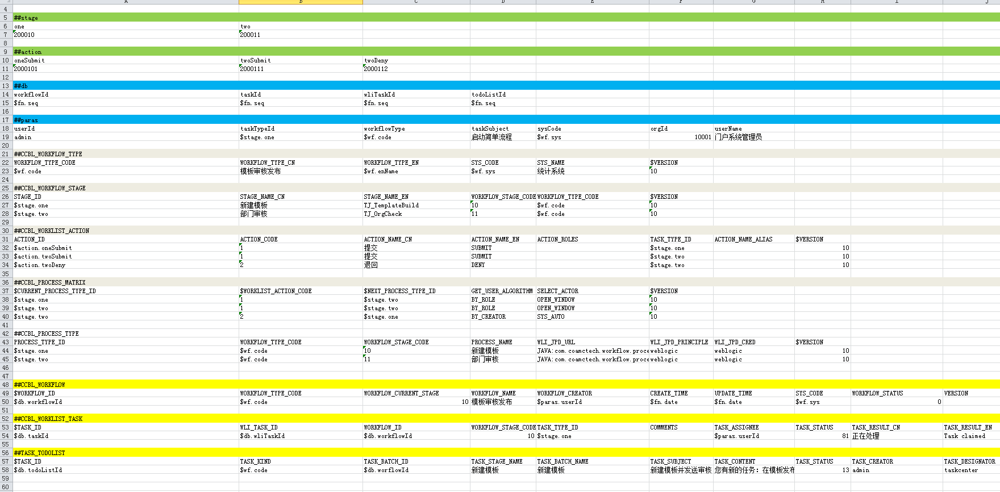
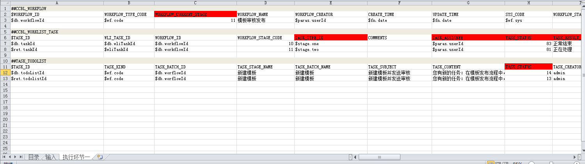
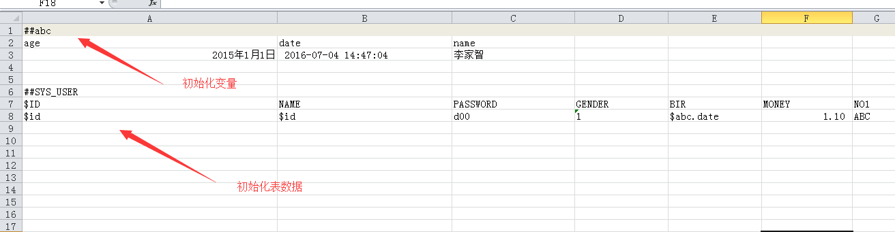
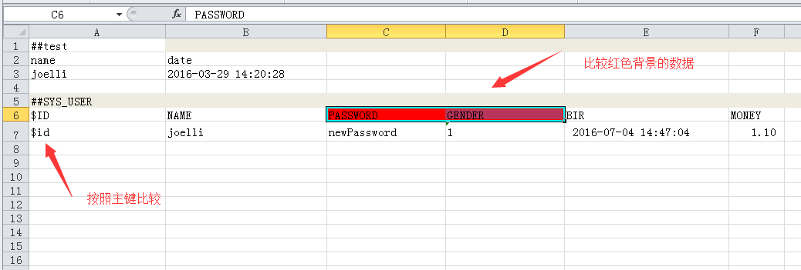
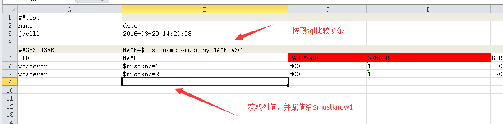
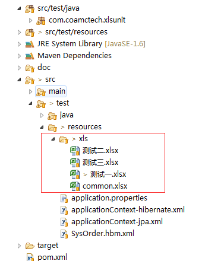
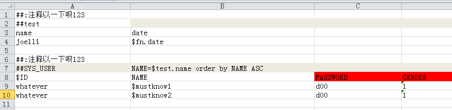

# xlsunit

单元测试框架,使用xls,作为输入,以及输出比较,适合大量数据库操作

# 安装

下载本工程后,pom install

然后在项目里引用

		<dependency>
			<groupId>com.coamctech</groupId>
			<artifactId>unit</artifactId>
			<version>${version}</version>
			<scope>test</scope>
		</dependency>

还需要:

		<dependency>
		    <groupId>org.jdom</groupId>
		    <artifactId>jdom</artifactId>
		    <version>2.0.2</version>
		    <scope>test</scope>
		</dependency>
		
# 实例:

创建一个俩个节点工作流，并模拟工作流已经启动，执行到节点一，分配给admin用户

执行环节一后，期望结果

 

# 预览

## 代码
 
	public class ServiceTest extends BaseJPAServiceTestSample {
		XLSParser userParser = null;
		@Autowired
		UserService userService;
	
		@Before
		public void init() {
			super.init();
			userParser = new XLSParser(BaseServiceTestSample.loader, "测试一.xlsx", dbAccess, BaseServiceTestSample.mapper,new RowHolderFacotoy.RowJPAHolderFacotoy());
		
		}
		@Test
		public void testUser1() {
			VariableTable vars = new VariableTable();
			// 公共输入，在excel的第二个sheet里配置
			userParser.init(vars);
			// 测试场景二，准备场景二参数
			userParser.prepare("场景1", vars);
			// 调用业务方法
			String id = (String) vars.find("id");
			userService.modifyUserInfo(id, "newPassword");
			//比较数据库数据与场景１数据是否匹配
			userParser.test("场景1", vars);
		}
		
## BaseJPA(Hibernate)ServiceTestSample

按照自己需求定义测试父类，如指定spring配置入口，指定excel的路径

	@TransactionConfiguration(defaultRollback = true)
	@RunWith(SpringJUnit4ClassRunner.class)
	@ContextConfiguration(locations = { "classpath:applicationContext-jpa.xml" })
	@Transactional
	public class BaseJPAServiceTestSample {
		
		protected JPADatabaseAccess dbAccess = null;
		
		
		@Autowired
		protected EntityManager em;
		
		@Autowired
		
		public static JPAMapper mapper  = null;
		public static XLSClassPathLoader loader = null;
		@BeforeClass
		public static void initData(){
			mapper = new  JPAMapper(new ImprovedNamingStrategy(),"com.coamctech.xlsunit");
			loader = new XLSClassPathLoader("/xls");
		}
	
		public void init() {
			dbAccess = new JPADatabaseAccess(em,mapper);
		}
		
		
	
	}

## excel

可以将测试数据写在excel里，或者通过数据库客户端工具粘贴到excel里完成数据的输入。

* 输入sheet

	

* 场景1	,按照主键比较

		

* 场景1	按照条件比较 

* excel 管理

## api

* VariableTable 变量表，xls里申明的变量或者操作数据库后的序列都放到此表里里，可以通过find方法，或者findSocpe获取变量
    
	vars.find("abc.age") 返回值
	vars.findInteger("abc.age") 返回整形
	vars.findScope("abc") 返回age,date name

* XLSParser 用于解析输入，计算后，与输出比较,init 公共输入，prepare(sheetName, vars),场景的数据准备 （这个不是必须调用的）， test(sheetName, vars);将数据库结果与sheetName 描述的数据做对比

XLSParser 依赖于 JPA还是Hibernate，使用俩种不同的RowHandler

	userParser = new XLSParser(BaseJPAServiceTestSample.loader, "测试一.xlsx", jpaDbAcess,new RowHolderFacotoy.RowJPAHolderFacotoy());
	
	orderParser = new XLSParser(BaseHibernateServiceTestSample.loader, "测试三.xlsx", hinberateAcess,new RowHolderFacotoy.RowHibernateHolderFactory());
	

* XLSBeanUtil 用于生成一个entity，输入时Map（来源于VariableTable），以及对象实例

	Map map = new HashMap<String, Object>();
	map.put("gender", 1);
	User user = new User();
	XLSBeanUtil.copyPropesrties(map, user);

# excel 格式

每一个excel包含了多个sheet，第一个sheet被parser忽略，一般用来介绍测试需求，以及每个sheet代表的测试场景。

## 输入

 第2个sheet是作为输入，可以初始化变量表和初始化数据库。无论是变量表还是数据库表，都必须用~空行~分开

* 变量表以##符号开头，后面紧紧跟以小写开头的变量scope名字。紧接一行是变量名字，再一行是变量值。变量类型取决于excel单元格类型，目前支持字符串，日期和number 类型。 

* 表数据以##符号开头，后面紧接跟着以大写开头的变量，下一行是列名字，如果是主键，需要加前缀 $ 加以说明。 紧接着的若干行是表数据，将通过用户配置方式，如JPA，Hibenate,或者SQL导入 插入到数据库里，如果主键是序列或者其他方式生成，可以使用$变量名，这样插入到数据库后，将id的值回传给变量表

* include 可以包含一个公共的输入，如 include /xxx.xls sheetname varscope, 这样xxx.xls的sheetName的数据将导入到数据库，期间的各种变量前缀为varsscope，如果没有指定varscope，则使用include里的varscope

## 输出

  输入sheet后的多个sheet作为场景比较sheet，结构类似输入，也包含变量表和表数据。当表数据完全匹配的时候，单元测试通过，否则，将提示此sheet的某一行，与数据库比较出错。
  
##  例子

* JPAServiceTest
* HibernateServiceTest

# xlsunit 的变量

xlsunit 中的 变量都保存在VariableTable里，可以通过java赋值，更多的情况是在excel里申明，也可以在表初始化数据里申明，如序列，uuid等字段

可以再任何地方使用$变量名方式在输入和场景里使用这些变量，如果变量已经存在，则对excel相应位置赋值，如果不存在变量，则改行执行过后，将该excel位置的得出的变量赋值该变量以供后面的处理

所有以fn开头的都是方法调用，比如fn.date ,获取当前时间，fn.seq 生成一个不重复的序列号，值为long型，你可以注册更多fn.xxx 方法来完成方法调用

# 注释

允许excel里使用注释，在每个数据快上部一行第一个单元格里使用##: 表示注释

	
	